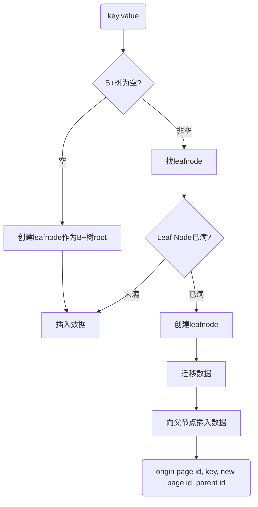
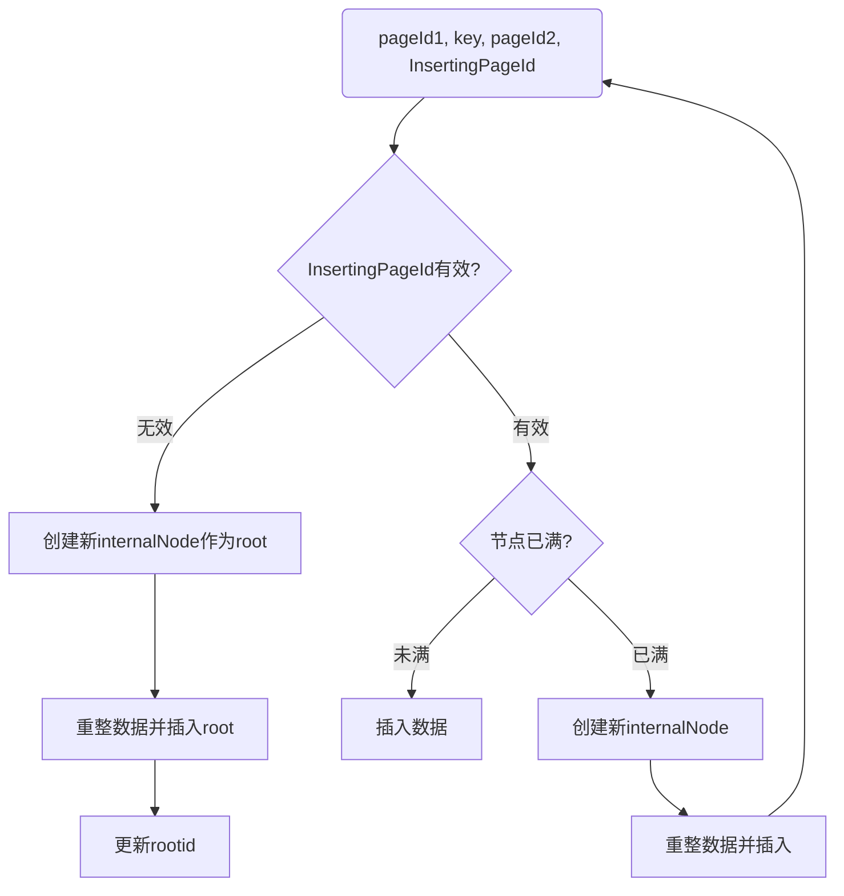

允许并发访问的B+树
<!-- more -->
# task 1: page
修改几个page页的getter setter和init
# task 2: B+ tree 基础操作
## insert
判断树是否为空，执行不同操作
1. 树为空：申请leaf page作为根节点，并初始化
2. 树不空：查找合适的位置插入

树查找过程（遍历internal page）：
1. 从1开始遍历，若searching key小于slot key，读前一个key的value作为下一个page
2. 若走到头，则读最后一个key的value作为下一个page

leaf查找过程（读leaf page）：
若size < max_size
1. 从0开始遍历
2. 若searching key等于slot key，return false
3. 若searching key小于slot key，insert

若size == max_size
1. 申请一个新的leaf page，新leaf page的父亲id为原leaf page的父亲id
2. 将后一半的entries复制到新page
3. 根据key向两个page中插入kv对
3. 向父亲节点插入(key, page id 2)，key为第二个leaf page的首个key（0）

父亲节点插入过程(page id 1, key, page id 2, InsertingPageId)：
1. 若 InsertingPageId 为InvalidPageId，说明son page是根节点，则申请一个新的internal page作为根节点，并初始化，
2. InsertingPageId 为实际page，则在该page上插入(key, page id2)

若size < max_size:
1. 从0开始遍历
2. 若page id 1 == value, 则从该节点后插入(key, page id 2)

若size == max_size:
1. 申请一个新的internal page(page id b)，parent page id设置为原有节点的parent page id
2. 
3. 将后一半的entries复制到新page，复制时需要空开key0，且将entries携带的parent page id改成page id b
4. 若该节点不是root，向父亲节点插入(page id a，key, page id b)，key为抽出的mid key
5. 若该节点为root节点，需要新建root节点，插入(page id a，key, page id b)，并将其设置为root节点，该节点的parent page id为新root节点page id

