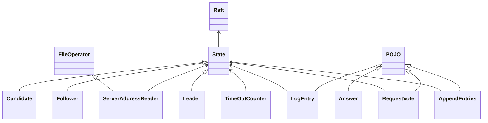
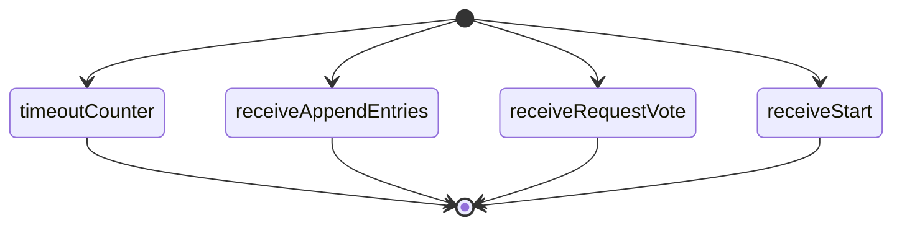
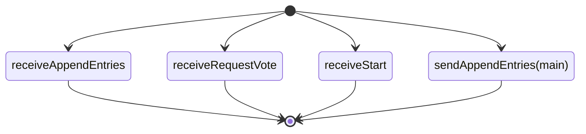
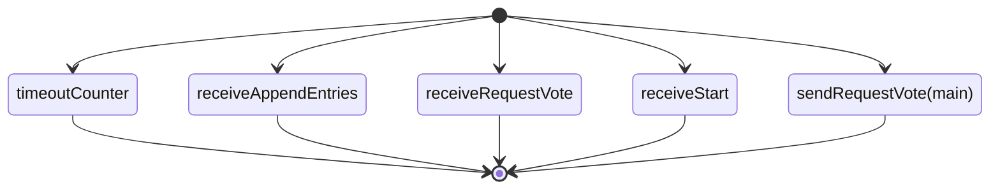

mit6.824 lab2。lab2 是后续实验的基础，实现一个Raft，lab3实现的KV是在Raft上的。

<!-- more -->

# 论文中给出的算法

## State状态

### 需要持久化的state（所有server）

1. **currentTerm**：server所处的term，也是该server所得知的最新term
2. **votedFor**：如果是null，则该term内尚未投票，如果是candidateID，则该term中的选举已经投票给了该candidate（不能再投票）。
3. **log**[]：当前server的所有log entries，每一条log entry包含命令和term编号

### 易失state（所有server）

1. **commitIndex**：最大的已经commit的log entries index
2. **lastApplied**：最新加入的log entries index

### 易失state（leader独有）

1. **nextIndex**[]：需要发给每一个follower的下一条log entry（初始化值是leader的最后一个log entry的下一个值）
2. **matchIndex**[]：每个follower当前匹配到哪一条log entry（初始化值为0）

## AppendEntries RPC

leader->follower

### 参数

1. **term**：leader的当前term编号
2. **leaderId**：leader的id，方便follower将收到的信息转发给leader
3. **prevLogIndex**：前一个log的index，方便follower确认一致性
4. **prevLogTerm**：前一个log的term，功能同上
5. **entries**[]：需要拷贝的多条log entry，心跳信息会是空
6. **leaderCommit**：leader提交的日志 entry index

或许可以带上leader自己的log entries，便于找nextIndex

### 返回值

1. **term**：follower所处的term，便于leader确认自己的地位
2. **success**：用于标志follower是否成功复制log entries。如果prevLogIndex/Term不匹配就会返回false

### Follower的处理逻辑

1. 直接返回false：term< currentTerm or prevLogIndex/Term对应的log不存在
2. 如果存在冲突entry，即相同的index，不同的term（就是leader没有的数据），删掉现有的entries并写入leader给的数据
3. 将不存在的entries追加到系统中
4. 当leaderCommit > commitIndex时，更新commitIndex = min(leaderCommit, 目前最新entry的index)

## RequestVote RPC

candidate->follower

### 参数

1. **term**：当前竞选leader的candidate的term
2. **candidateId**：当前竞选leader的candidate的ID
3. **lastLogIndex**：最后一条log entry的index
4. **lastLogTerm**：最后一条log entry的term

### 返回值

1. **term**：follower的term，如果candidate没有这个大，将会退回到follower状态
2. **voteGranted**：该follower是否投票给该节点

### follower处理逻辑

1. 直接返回false：term < currentTerm
2. 如果 （votedFor == null || votedFor == candidateId） && candidate的log比当前节点新，投票给该节点，否则拒绝该节点

## Server Rules

所有server都需要执行的：

1. if commitIndex > lastApplied: commitIndex之前的日志将会被执行，更新lastApplied到commitIndex
2. if RPC请求或回复包含term，且term > currentTerm，则更新currentTerm，并转换到follower

### Follower

1. 回应candidate和leader的RPC调用（自己注册一个函数）
2. 选举计时器超时参加选举

### Candidate

1. 开始参加选举的动作：currentTerm自增、给自己投票、随机一个新的选举计时器、给其他server发送RequestVote RPC
2. if 收到过半服务器的投票：成为leader
3. if 收到新leader的AppendEntries RPC：成为follower
4. if 选举计时器超时：重新参加选举

### Leader

1. 当选后：立即给其他server发送心跳信息（空AppendEntries），防止超时重新选举
2. 从client处接收到command：向本地log写入entry，当该log entry commit时，向client回复信息
3. if last log entries index >= 某一个follower的nextIndex，向该follower发送AppendEntries RPC新增其日志。如果成功，则更新nextIndex和matchIndex，如果失败，则降低其nextIndex重试
4. if 存在N>commitIndex && N <= 过半数的 matchIndex && index为N的日志的term==currentTerm， then 更新commitIndex = N

# 实验

lab2 是后续实验的基础，实现一个Raft，lab3实现的KV是在Raft上的。

## Lab2A

实现一个Raft选举算法

### 类架构

### 线程梳理

Raft运行主线程，不断地切换状态，切换的过程是由上一个状态创建新状态并返回其指针
状态的run函数在Raft主线程中运行，会创建多个线程。线程管理逻辑在构造和析构函数中处理
1. candidate/follower:计算超时的线程timeOut。（单独开一个类来承担这个职责）Sleep超时计时器的时间后检测是否有收到过AppendEntries RPC（这里需要一个标志位）。如果收到过，则复位标志位，并Sleep，如果没有收到过，则终止当前状态（该状态会创建candidate状态返回），退出该线程。这里的终止状态需要考虑到RPC Server的退出，根据[rest_rpc在GitHub的issue](https://github.com/qicosmos/rest_rpc/issues/51)中提到的，可以通过智能指针创建server，退出时将其置为nullptr。
2. all:等待接收AppendEntries。开一条线程用于RPC通信，接收其他server（此处指leader）的AppendEntries请求，这里需要对log相关变量加锁，避免产生幻觉
3. all:投票线程RequestVote。开一条线程用于RPC通信，接收其他server（此处指candidate）的RequestVote请求，这里需要对vote相关变量加锁，避免产生幻觉
4. all:等待client的start。开一条线程用于RPC通信，接收client的command，这里需要对log相关变量加锁，避免产生幻觉
5. leader:发送AppendEntries的线程。调用其他server的AppendEntries，并异步等待结果
6. candidate:发送RequestVote的线程。调用其他server的RequestVote，并异步等待结果。

以下按状态机类型梳理线程
#### Follower

#### Leader

#### Candidate

### 线程间协同

线程间同步依赖锁和nextState信号
所有接收信息的线程都加一把大锁，保证同时只能有一个接收信息的线程执行，若需要退出线程，则将nextState赋值为下一个状态
处理事务的线程在处理过程中需要访问nextState，若nextState非空，则说明此处需要停止执行事务，退出并返回下一个状态的指针。

* 计时器守护线程：计时器相当于线程中的守护线程，若该线程结束，其他线程都需要结束（通过在计时器线程结束时调用停止其它线程的函数实现）。故若需要结束当前状态时，可以通过调用结束计时器的函数结束掉所有的线程。

### debug日志
#### 2023年10月26日
bug：目前第一次vote无法成功接收
debug方向：
1. 调试一个follower，查看其第一次vote结果是否正常返回
2. 调试一个candidate，查看其收到的数据是否正常解码（可能性较大）**返回值为空！**

#### 2023年10月27日
bug：candidate调用requestVote返回值为空字符串
debug方向：
1. sendRequestVote没有成功：已排除，follower端可以收到信息
2. follower端没有返回值：基本排除，follower端能打出返回值
3. rpc的问题：感觉这个可能性比较大，但是似乎没有办法debug，而且其他调用没有出问题，为什么只有这个会出问题？
解决方案：
1. 强行跳过返回值为空的future，失败，应该是所有返回值都为空
2. 原有序列化方式可能存在问题（手动序列化），更换序列化方式（√）
3. 更改注册方式，使用原始方式（√）

#### 2023年10月28日
已修复上述bug

#### 2023年10月29日
bug: Leader 调用 sendAppendEntries 无法正常到达follower
debug方向：
1. 发送端没有发送成功，follower端没有收到信息(x)
2. 发送端发送成功，follower端没有收到信息(x)
3. 发送端发送成功，follower端收到信息，但是无法解码(x)
4. 发送端发送成功，但是发送端的信息错误，目前定位到问题在于Leader::checkFollowers中，nextIndex[followerID] >= logEntries.size()没有按逻辑执行，初步猜测是logEntries的异步访问导致的，但是加锁无用
已修复，发送端编码也有问题，多加一个空格就好（有精力要把接口都改成官方提供的序列化接口）

## Lab2B
实现AppendEntries，写Lab2A的时候已经完成了，只需要加上client端发送start和接收applyMsg的逻辑
## Lab2C
持久化，每隔一段时间将需要持久化的状态写一次磁盘
## Lab2D
快照，这个需要进一步设计，目前打算借助AppendEntries和ApplyMsg，添加标志位完成。
添加标志位`bool snapshot`
### follower处理逻辑
1. 收到AppendEntries时，若snapshot为false，则正常处理，并退出该过程
2. 发送给上层应用的applyMsg里也需要附带状态写磁盘
3. 删除AppendEntries的commitedIndex以前的命令
4. 返回true
### leader处理逻辑
commitedIndex超过命令阈值后需要进行写快照并删除命令，具体操作为
1. 判断commitedIndex是否大于快照阈值，若小于则退出
2. 给所有follower发送带有快照请求的AppendEntries
3. 若半数以上的follower返回成功，则写快照（即给上层应用发送的applyMsg里附加写磁盘命令）并删除命令
4. 修改nextIndex和matchIndex，同时减去删除的命令数量（即commitedIndex + 1）
### candidate处理逻辑
同follower，因为candidate收到AppendEntries时说明该进入Follower状态了