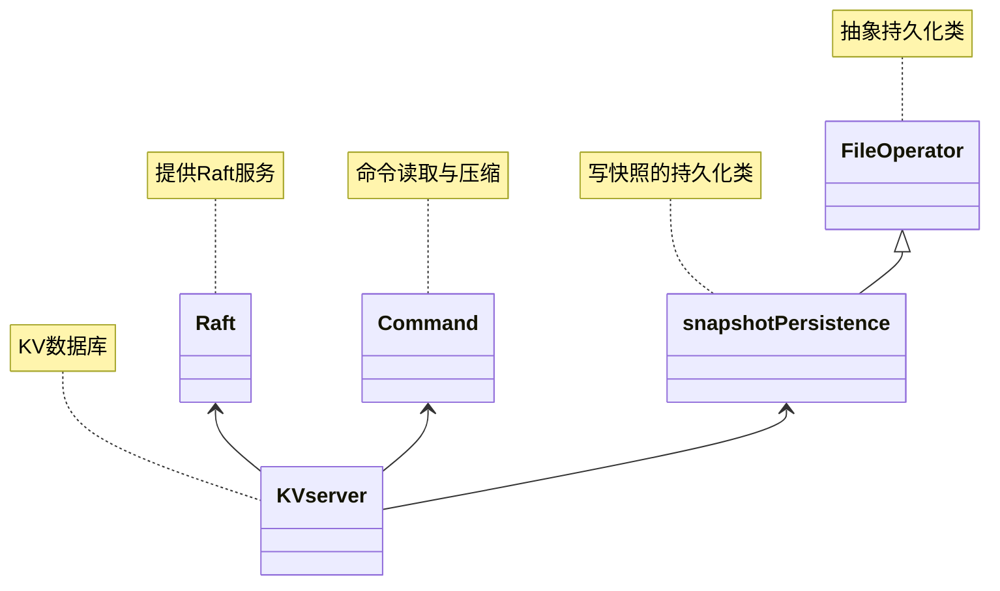

建立在raft协议上的KV数据库
<!-- more -->
# 概要设计
使用Raft共识算法搭建一个提供**日志压缩**保证**线性一致性**的KV数据库。
KV数据库将提供三个功能，对应三个接口Put(key, value)，Append(key, arg)，Get(key)。
1. Put(key, value)：将key值的value赋值/替换成value
2. Append(key, arg)：将key值的value赋值/追加上arg
3. Get(key)：获取key值的value，若为空，则返回空字符串

该KV数据库需要完成以下任务：
1. 命令幂等性转换：防止多包错误
2. 命令压缩成字符串：在client端完成编码
3. 写快照：将KV数据库压缩成一个文件写入
# 详细设计
## 类设计

## 数据结构设计
