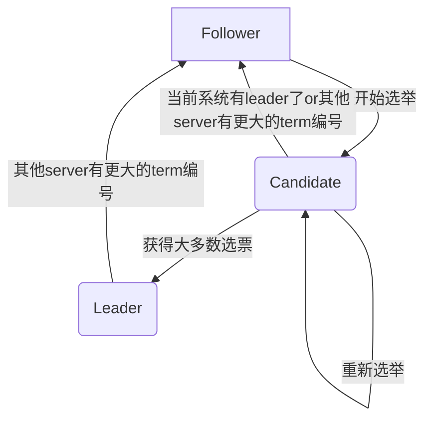

分布式协同算法 Raft

<!-- more -->

# 论文阅读

以前的算法存在两个问题，1. 不容易理解2.对于现实问题没有好的基础，所以raft设计的目标就是好理解。为此，Raft使用了两个方法，1.问题分解2.简化系统状态
raft算法核心是leader，leader的产生简化了系统，因为leader可以决定新日志条目存放的地方，数据流也只从leader流向其他server。系统最简单来说就是两步

1. 选举leader
2. leader管理复制日志

具体而言，Raft将问题分解为以下几个子问题

1. **leader选举**
2. **日志复制**：leader管理
3. **安全**：保证系统属性安全

## Raft基础

### 状态state

系统中的server有三个状态 `leader`、`follower`、`candidate`。
`follower`是完全被动的接收来自其他两种server的指令；`leader`会处理所有来自client的请求，其他server也将请求转发给 `leader`；`candidate`则是选举过程中的中间状态。

### 时间片term

系统的term（时间片）是任意(随机)长度的，每一个term都由选举开始，如果选举失败，该term立即终止，马上进入下一个term。Raft始终保证系统中有且仅有一个leader。
系统中的server保存了当前的term编号，如果server发现自己的term编号比其他server小，则自增到新的term编号，如果leader或candidate发现自己的编号过时了，则马上降级到follower
如果server收到了term编号不对的请求，将该请求丢弃。

### 通信 RPC

系统中需要三条RPC通信路径

1. **RequestVote RPCs**：在选举过程中，由候选者初始化
2. **AppendEntries RPCs**：由leader初始化，在系统运行时提供日志条目复制和心跳功能
3. **TransferSnapshot RPCs**：传递server快照的RPCs

## Raft性质

Raft算法运行中全程保证这些性质成立

1. **选举安全**：一个term中至多存在一个leader
2. **leader仅追加log**：leader的log不会被其他server覆写
3. **log匹配**：两个拥有相同index和term的log必然完全相同，且前序log也相同
4. **leader完整性**：committed的log entry一定会在后续的leader log中出现
5. **状态机安全性**：

## 选举

server以follower身份启动，leader会定时发心跳信息（无日志信息的appendEntries）给follower维护自己的leader地位。当follower超时未收到心跳信息时则开启选举。
选举过程是follower将term编号自增并进入candidate状态，然后给自己投票，并向其他server并行发出RequestVote RPCs请求票。
每个server在一个term里至多给一个server投票，投票遵循先到先得原则。

### 选举结果

candidates状态的结果有三种：

1. 获取大部分选票，赢得选举->leader 开始发心跳信息维护自己的leader地位
2. 收到了其他server的RequestVote RPCs，若其term编号大于等于自己，则认定其为合法leader->follower （否则自己仍为candidate）
3. 当多个server同时进入candidate状态并发送RequestVote RPCs，没人赢得选举->candidate 重启选举流程

### 随机超时机制

为了保证系统尽量少进入第三个状态，即无人赢得选举，不停地选举，Raft采用随机的超时时限（150-300ms之间）。这样可以保证在在某一个时刻，只有一个server发现超时，并赢得选举。
每一个candidate在term开始时重新获取一个随机超时时限，

## 日志复制

当client发送命令时，系统中会按顺序发生如下事件：

1. leader追加一个新的log entry，也就是这条命令
2. 发布AppendEntries RPCs给其他server
3. 当这个entry完成安全的复制后，leader会执行该命令
4. 返回执行结果给client

### 日志内容

日志将包含两个部分：

1. 状态机命令
2. term编号：标记这条命令产生的时期

### commited entry

* 当entry被大多数（为什么是大多数？）server复制时，该log entry会变成commited状态。Raft将会保证系统中commited的entry被持久化以及被所有server执行。
* 当一条log entry是commited时，这条日志之前的所有entries都会被commit，不论任何leader产生的。
* leader会追踪将要commit的最早entry，并用其发送appendEntries RPCs
* 当follower得知entry被commit以后，就会执行该entry包含的命令

### 运行时日志一致性保证

日志有两个属性

* index和term相同的log，命令必然相同
* index和term相同的log，前置log必然相同

发送AppendEntries RPC时，leader会将前一个log的index和term也附上，如果follower没找到前一个log，那也不读入当前log

### leader对日志一致性保证

正常运行时，leader和多个follower的日志将会保持一致，当leader挂掉重新选举时，可能会导致日志出现不一致的现象，此时leader将自己的log强制复制给follower。leader会为**每个follower**更新nextIndex，用来指示向特定follower发送的下一条log entry。具体做法是：

1. **初始化**：将nextIndex初始化为leader的最后一条log entry的下一条
2. **试错**：给follower发送下一条的AppendEntries，如果失败，nextIndex--（也可以通过返回entries，让leader直接查找nextIndex）
3. **结果**：当AppendEntries成功时，正确的nextIndex就找到了
4. **更新**：将leader后续的log entries通过AppendEntries发送给follower，覆盖掉不一致的日志

通过这些措施，leader在选举成功后，就会让整个系统里的follower逐渐收敛到自己的日志中来。同时，leader是不会删除（覆盖）自己的日志，只会覆盖掉follower的日志

## 安全性

### 选举限制
为了简化算法，只允许log entries从leader流向follower，Raft保证leader会包含已经被提交的所有log entries。
Raft使用voting的方法来保证leader拥有所有的log entries。candidate发送带有自己所有log entries的RequestVote RPC给其他server，如果其他server发现candidate的log entries没有自己新，则否决该candidate。
判断log entries新旧方法：比较最后一个log entry的index和term，term编号更大的更新，如果term编号一样，则index更大的更新

### 提交限制
leader只能提交当前term中的log entry，相当于间接提交了其他term的log entry

# 课堂记录
## 脑裂
之前提到的容错系统mapreduce、GFS、Vmware FT，都是单主节点。单主节点本身就是一个单点障碍，一旦出错就比较麻烦。
主节点出错的一个方式是split brain(脑裂)，也就是说系统中存在多个主节点，可能会导致系统中出现各种矛盾和错误
解决方案包括两种
1. 构建完美的网络：高成本
2. 人工解决问题：慢

## Raft
在系统中raft相当于底层服务，由上层应用调用。上层应用可以是多样的，例如kv数据库等。
client向raft的leader发送请求后，leader将该请求变成日志发送给集群中的其他server。
当**半数以上**的server拷贝了该日志后，raft向上层应用发送信息并commit该log entry。
commit信息会随着AppendEntries（心跳or下一条日志）发送给follower，follower也会执行该操作。
### 日志
在Raft中日志有以下作用：
1. **确定操作顺序**：leader收到不同操作后通过日志确定顺序
2. **缓存操作**：follower收到操作后缓存，等待leader发送commit信号；leader缓存操作，给follower重发信号
3. **状态恢复**：
### 应用层接口
1. (index, term) start(command):client给server发送请求的接口，如果发给了follower，follower将会转发给leader （客户端要term干嘛？）
2. applyMsg(command, index): commit命令后，返回给client的index和command（）

# 论文中给出的算法
## State状态

### 需要持久化的state（所有server）
1. **currentTerm**：server所处的term，也是该server所得知的最新term
2. **votedFor**：如果是null，则该term内尚未投票，如果是candidateID，则该term中的选举已经投票给了该candidate（不能再投票）。
3. **log**[]：当前server的所有log entries，每一条log entry包含命令和term编号

### 易失state（所有server）
1. **commitIndex**：最大的已经commit的log entries index
2. **lastApplied**：最新加入的log entries index

### 易失state（leader独有）
1. **nextIndex**[]：需要发给每一个follower的下一条log entry（初始化值是leader的最后一个log entry的下一个值）
2. **matchIndex**[]：每个follower当前匹配到哪一条log entry（初始化值为0）

## AppendEntries RPC
leader->follower

### 参数
1. **term**：leader的当前term编号
2. **leaderId**：leader的id，方便follower将收到的信息转发给leader
3. **prevLogIndex**：前一个log的index，方便follower确认一致性
4. **prevLogTerm**：前一个log的term，功能同上
5. **entries**[]：需要拷贝的多条log entry，心跳信息会是空
6. **leaderCommit**：leader提交的日志 entry index

或许可以带上leader自己的log entries，便于找nextIndex

### 返回值
1. **term**：follower所处的term，便于leader确认自己的地位
2. **success**：用于标志follower是否成功复制log entries。如果prevLogIndex/Term不匹配就会返回false

### Follower的处理逻辑
1. 直接返回false：term< currentTerm or prevLogIndex/Term对应的log不存在
2. 如果存在冲突entry，即相同的index，不同的term（就是leader没有的数据），删掉现有的entries并写入leader给的数据
3. 将不存在的entries追加到系统中
4. 当leaderCommit > commitIndex时，更新commitIndex = min(leaderCommit, 目前最新entry的index)

## RequestVote RPC
candidate->follower

### 参数
1. **term**：当前竞选leader的candidate的term
2. **candidateId**：当前竞选leader的candidate的ID
3. **lastLogIndex**：最后一条log entry的index
4. **lastLogTerm**：最后一条log entry的term

### 返回值
1. **term**：follower的term，如果candidate没有这个大，将会退回到follower状态
2. **voteGranted**：该follower是否投票给该节点

### follower处理逻辑
1. 直接返回false：term < currentTerm
2. 如果 （votedFor == null || votedFor == candidateId） && candidate的log比当前节点新，投票给该节点，否则拒绝该节点

## Server Rules
所有server都需要执行的：
1. if commitIndex > lastApplied: commitIndex之前的日志将会被执行，更新lastApplied到commitIndex
2. if RPC请求或回复包含term，且term > currentTerm，则更新currentTerm，并转换到follower
### Follower
1. 回应candidate和leader的RPC调用（自己注册一个函数）
2. 选举计时器超时参加选举
### Candidate
1. 开始参加选举的动作：currentTerm自增、给自己投票、随机一个新的选举计时器、给其他server发送RequestVote RPC
2. if 收到过半服务器的投票：成为leader
3. if 收到新leader的AppendEntries RPC：成为follower
4. if 选举计时器超时：重新参加选举
### Leader
1. 当选后：立即给其他server发送心跳信息（空AppendEntries），防止超时重新选举
2. 从client处接收到command：向本地log写入entry，当该log entry commit时，向client回复信息
3. if last log entries index >= 某一个follower的nextIndex，向该follower发送AppendEntries RPC新增其日志。如果成功，则更新nextIndex和matchIndex，如果失败，则降低其nextIndex重试
4. if 存在N>commitIndex && N <= 过半数的 matchIndex && index为N的日志的term==currentTerm， then 更新commitIndex = N

# 实验
lab2 是后续实验的基础，实现一个Raft，lab3实现的KV是在Raft上的。

## Lab2A
实现一个Raft选举算法
### 线程梳理
Raft运行主线程，不断地切换状态，切换的过程是由上一个状态创建新状态并返回其指针
状态的run函数在Raft主线程中运行，会创建多个线程。以下按状态机类型梳理线程
#### 所有server，尤其是Follower
1. 计算超时的线程timeOut。（单独开一个类来承担这个职责）Sleep超时计时器的时间后检测是否有收到过AppendEntries RPC（这里需要一个标志位）。如果收到过，则复位标志位，并Sleep，如果没有收到过，则终止当前状态（该状态会创建candidate状态返回），退出该线程。这里的终止状态需要考虑到RPC Server的退出，根据[rest_rpc在GitHub的issue](https://github.com/qicosmos/rest_rpc/issues/51)中提到的，可以通过智能指针创建server，退出时将其置为nullptr。
2. 等待接收AppendEntries。开一条线程用于RPC通信，接收其他server（此处指leader）的AppendEntries请求，这里需要对log相关变量加锁，避免产生幻觉
3. 投票线程RequestVote。开一条线程用于RPC通信，接收其他server（此处指candidate）的RequestVote请求，这里需要对vote相关变量加锁，避免产生幻觉
#### Leader
1. 等待client的start。开一条线程用于RPC通信，接收client的command，这里需要对log相关变量加锁，避免产生幻觉
2. 发送AppendEntries的线程。调用其他server的AppendEntries，并异步等待结果。
#### Candidate
1. 发送RequestVote的线程。调用其他server的RequestVote，并异步等待结果。