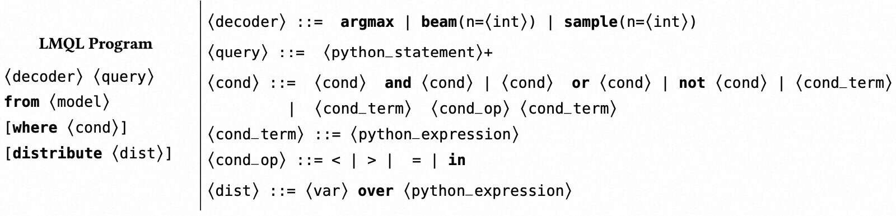
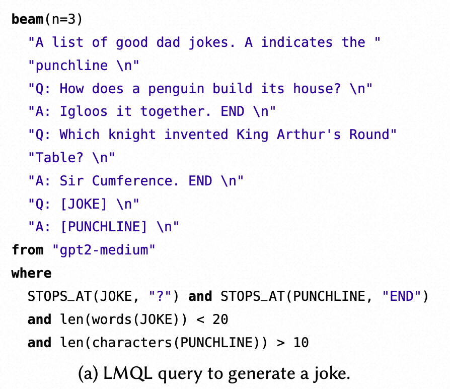

PLDI2023的文章，提出LMP(Language Model Programming, 语言模型编程)思想，设计了LMQL(Language Model Query Language, 语言模型查询语言)，它利用来自 LMP prompt的约束和控制流，以生成有效的推理过程，最大限度地减少对底层语言模型的昂贵调用的数量。

<!-- more -->

# Background

LLM很牛逼，但是使用过程中面临这些问题

1. 程序是task-specific model-specific的（无法泛化）
2. 需要多次交互（不够自动化）
3. 输出太长（没有约束）
4. 效率和性能（）

因此提出了一种新理论，LMP(Language Model Programming, 语言模型编程)，并给出其实践LMQL(Language Model Query Language, 语言模型查询语言)。

# LMP

LMP思想是：使用少量的**脚本**和**输出限制**，实现前后端分离的LLM提示词工程。例如，允许用户定义复杂的交互、控制流和输出限制。

* **脚本**：自动化
* **输出限制**：省钱+提高效率

# LMQL

## 语法定义

## 例子

