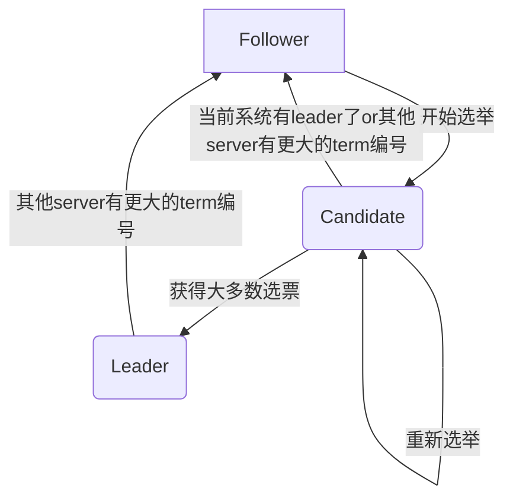

如题

<!-- more -->

# Raft是什么？

专业术语(~~高大上的话~~)：分布式共识协议，确保在分布式系统中各个节点之间达成一致的数据状态。

大白话：让所有服务器（节点）统一状态

# 大概是怎么做到的？

核心思想：Raft算法通过**选举Leader**，让Leader确保系统中的所有节点以一致的顺序接收和**应用**相同的指令序列，从而保证数据一致性和可靠性。

Raft将共识问题分成两个子问题：

1. Leader选举
2. 日志同步

此外，我们还有两个重要的假设：

1. term： 系统时间片。提供follower超时选举、candidate重新选举、防止brain split等功能。每次开启选举时+1（包括Follower超时选举和Candidate重新选举）

   > brain split：脑裂，即指系统中同时出现多个leader的情况
   >
2. RPC：所有的数据都是从Leader/Candidate流向Follower的，Leader往外发的**AppendEntries**提供日志复制和心跳功能，Candidate往外发的**RequestVote**提供请求选票功能

## 选举

### 系统状态

Raft系统中定义了三个不同的状态，每个节点仅为其中一个状态。

1. Follower：完全被动的接收来自其他两种server的指令
2. Candidate：选举过程中的中间状态
3. Leader：保证系统中其他节点和本节点的同步

### 选举流程：

1. **超时选举**：节点进入系统是follower状态，如果一段随机时间内都没有收到Leader发送的AppendEntries，则term自增，超时选举成为Candidate。
2. **候选**：Candidate选举过程中若收到过半选票则成为Leader，若收到所有回应，但选票没过半，则term自增，重新选举
投票原则：每个term只投一次，只投给term比自己大且日志比自己新的节点（依次比较term和index）
3. **Leader的初始化工作**：Leader的初始化操作包括：发送心跳维护地位，初始化next和applied，前者为日志条数，后者为-1

> 与论文不同，本系统日志index从0开始计数

4. **状态回退与更新**：Candidate和Leader运行过程中若收到term比自己大的指令，则成为Follower，并更新term；Follower若收到term比自己大的指令，则只更新term

## 日志同步
### 日志内容
1. index：每个日志条目都有一个唯一的索引值，用于标识该条目在日志中的位置。
2. term：任期号，表示该条目所处的任期（Leader接收该命令的任期）
3. command：需要在状态机上执行的指令
### 日志复制
核心思想是Leader将Follower的日志同步到自己的状态序列。具体做法是Leader利用AppendEntries同步。
1. Leader的next数组和applied数组分别记录要向每个follower发送的下一条日志和已经确认的日志。前者用于发送日志，初始化值为日志的末端；后者用于确认commit，初始化值为日志前端。
2. Leader发送AppendEntries时，会带上prevIndex和prevTerm，表示上一条日志的index和term。保证Follower能衔接上，若被拒绝，则nextIndex自减再发
3. Follower若在自己的日志序列中能找到与prevIndex和prevTerm匹配的日志，则将日志复制到自己的日志序列中，并确认该日志，否则拒绝
# 具体实现逻辑
## AppendEntries
### 参数

1. **term**：leader的当前term编号
2. **leaderId**：leader的id，方便follower将收到的信息转发给leader
3. **prevLogIndex**：前一个log的index，方便follower确认一致性
4. **prevLogTerm**：前一个log的term，功能同上
5. **entries**[]：需要拷贝的多条log entry，心跳信息会是空
6. **leaderCommit**：leader提交的日志 entry index

或许可以带上leader自己的log entries，便于找nextIndex

### 返回值

1. **term**：follower所处的term，便于leader确认自己的地位
2. **success**：用于标志follower是否成功复制log entries。如果prevLogIndex/Term不匹配就会返回false
## RequestVote
### 参数

1. **term**：当前竞选leader的candidate的term
2. **candidateId**：当前竞选leader的candidate的ID
3. **lastLogIndex**：最后一条log entry的index
4. **lastLogTerm**：最后一条log entry的term

### 返回值

1. **term**：follower的term，如果candidate没有这个大，将会退回到follower状态
2. **voteGranted**：该follower是否投票给该节点

## 状态机属性
需要持久化的属性
1. **currentTerm**：server所处的term，也是该server所得知的最新term
2. **votedFor**：如果是null，则该term内尚未投票，如果是candidateID，则该term中的选举已经投票给了该candidate（不能再投票）。
3. **log**[]：当前server的所有log entries，每一条log entry包含命令和term编号

不需要持久化的属性

1. **commitIndex**：最大的已经commit的log entries index
2. **lastApplied**：最新加入的log entries index

## Leader
### 独有属性
* **nextIndex**[]：需要发给每一个follower的下一条log entry（初始化值是leader的最后一个log entry的下一个值）
* **matchIndex**[]：每个follower当前匹配到哪一条log entry（初始化值为0）
### 主线程
1. 初始化nextIndex和appliedIndex
2. 发送心跳
3. 检测follower返回值并发送新的心跳/日志
### 接收AppendEntries线程
1. 检测term，若比自己大则退回到follower状态，term置为该term，并以follower状态处理该AppendEntries
2. 拒绝该AE，发送自己的term
### 接收RequestVote线程
1. 检测term，若比自己大则退回到follower状态，term置为该term，并以follower状态处理该RV
2. 拒绝该RV，发送自己的term
## Candidate
### 主线程
1. 给所有其他节点发送RequestVote
2. 检测follower返回值
3. 检测是否获得半数选票
4. 获得半数选票则成为Leader，否则term自增重启选举
### 接收AppendEntries/RequestVote线程
和Leader相同
## Follower
### 接收AppendEntries线程
1. 检测term，若比自己小则拒绝并返回自己的term
2. 检测prevIndex和prevTerm，若不存在则返回拒绝信息
3. 从prevIndex开始复制日志，并确认
### 接收RequestVote线程
1. 检测term，若比自己小则拒绝并返回自己的term
2. 检测日志，若比自己更旧，则返回拒绝信息
3. 如果没有投过票或给这个节点投票了，则返回同意信息并更新voteFor，否则拒绝

# Raft优化
## 读优化
### read index

read index所解决的核心问题有两个：

1. leader是否有效
2. 前面的logEntry是否提交

具体方式为：

1. 将当前未commit的logEntry提交确保系统状态已更新
2. 提交后发起一轮心跳确保当前leader是唯一有效的
3. 回应client的读操作

对比原始raft算法优点：

1. 不必将读操作变成logEntry复制到集群中的所有节点上和等待commit，节约了至少一次commit的时间
### lease read

核心是leader**计算最小独立掌权时间**。leader维护一个租约机制，当租约未过期时，可以在commit了所有entries以后直接返回，不必发心跳。
租约机制通过选举超时时限和发布心跳时间计算最小独立掌权时间，即$leaseTime = start+timeout$。
由于不同CPU的时钟会有误差，故使用$leaseTime = start+\frac{timeout}{clock\ drift\ bound}$，但是实际上这个算法仍然存在问题，故不会被作为默认算法。

对比原始read index优点：
不用心跳
## 选举优化

raft选举过程中仍存在多个问题

### prevote

解决的核心问题：
出现网络分区时，小分区里的节点无法选举成功会不断尝试，并增加term。当网络分区恢复时，小分区节点和leader的通讯会导致leader卸任。但是leader不应该卸任。

解决方案：
在真正的选举之前进行一轮预选举，如果能成功再正式发起选举，否则放弃本轮选举，等待下一个election timeout

### priority election

解决的核心问题：
raft不支持优先级选举

解决方案:
引入节点优先级和全局优先级，选举前比一比

具体方案：

1. 每次心跳都更新全局最高优先级
2. 超时时比较节点优先级和全局最高优先级，若节点优先级>=全局最高优先级，则开启选举
3. 若选举超时仍未选出leader，则$全局最高优先级 = max(1, 全局最高优先级 * 0.8)$

存在的问题：
当最高优先级不存在时，选举时可能会浪费一轮选举时间
