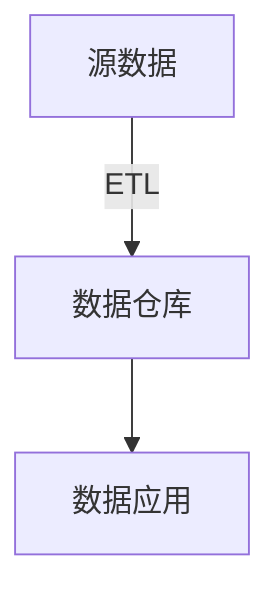

数据仓库基础知识
<!-- more -->
# 数据仓库是什么？
数据仓库是一个存储和管理大量结构化和非结构化数据的系统。它用于集成来自多个不同来源的数据，并对其进行清洗、转换和整合，以支持企业的决策制定和分析需求。数据仓库通常用于存储历史数据，并且经过组织和优化，使得用户可以轻松地进行复杂的查询、分析和报告。

数据仓库是面向主题的（Subject-Oriented）、集成的（Integrated）、不可更新性的（Non-Volatile）和时变的（Time-Variant）**数据集合**，用以**支持管理决策**。
## 面向主题
操作型处理（传统数据）对数据的划分并不适用于决策分析。而基于主题组织的数据则不同，它们被划分为各自独立的领域，每个领域有各自的逻辑内涵但互不交叉，在抽象层次上对数据进行完整、一致和准确的描述。一些主题相关的数据通常分布在多个操作型系统中。
## 集成
通过对分散、独立、异构的数据库数据进行抽取、清理、转换和汇总便得到了数据仓库的数据

因为同主题的数据可能来自不同的数据源，它们之间会存在着差异（异构数据）。因此需要对这些数据进行处理，即ETL：

（1）统一源数据。如字段的同名异义、异名同义、单位不统一、字长不一致，等等。

（2）数据综合和计算。数据仓库中的数据综合工作可以在从原有数据库抽取数据时生成，但许多是在数据仓库内部生成的，即进入数据仓库以后进行综合生成的。

## 不可更新
数据经加工和集成进入数据仓库后是极少更新的，通常只需要定期的加载和更新。

## 时变性
数据仓库的数据需要更新，以适应决策的需要

# 数据仓库和数据库的区别
本质上是OLTP和OLAP的区别
**操作**型处理，叫联机**事务**处理OLTP（On-Line Transaction Processing，），是针对具体业务在数据库联机的日常操作，通常对少数记录进行查询、修改。
用户较为关心操作的响应时间、数据的安全性、完整性和并发支持的用户数等问题。传统的数据库系统作为数据管理的主要手段，主要用于操作型处理。

**分析**型处理，叫联机**分析**处理OLAP（On-Line Analytical Processing）一般针对某些主题的大量历史数据进行分析，支持管理决策。

* 数据库是**面向事务**的设计，数据仓库是**面向主题**设计的。
* 数据库一般存储**业务数据**，数据仓库存储的一般是**历史数据**。
* 数据库设计是尽量**避免冗余**，符合业务应用，但是不符合分析。数据仓库在设计是有意引入冗余，依照分析需求，分析维度、分析指标进行设计。
* 数据库是为**捕获数据**而设计，数据仓库是为**分析数据**而设计。

企业中一般先有数据库，然后有数据仓库，可以没有数据仓库，但是不能没有数据库。

数据仓库不是大型的数据库，只是一个**数据分析平台**。

数据仓库，是在数据库已经大量存在的情况下，为了进一步挖掘数据资源、为了决策需要而产生的数据分析平台，不是所谓的“大型数据库”。

p.s. 数据仓库和数据湖的区别是数据湖可以分析非结构化数据

# 数据仓库和数据湖的区别
数据仓库和数据湖都是用于存储和管理数据的概念，但它们在数据组织、结构和用途上有所不同。

1. 数据仓库：

* 结构化数据：主要用于存储**结构化**数据，通常是经过清洗、整合和转换的数据，以支持特定的业务需求和分析。
* 数据模型：采用**预定义**的模式和架构，数据以预定的格式和结构存储在数据库中，适用于特定的查询和分析目的。
* 用途：主要用于支持决策制定、报告和分析，为业务用户提供已经加工好的数据视图。

2. 数据湖：

* 不受限制的数据结构：能够容纳各种形式和类型的数据，包括结构化、半结构化和非结构化数据，原始数据以及未经处理的数据。
* 灵活性和多样性：数据湖不需要提前定义模式或结构，数据以**原始形式**存储，提供更大的灵活性和多样性，可以支持更广泛的数据分析和探索。
* 用途：适用于更广泛的数据探索、机器学习、高级分析以及需要处理大量原始数据的场景。
在实际应用中，有时候数据仓库和数据湖可能会相互补充。数据仓库提供了经过整理和加工的数据，适用于特定的分析和查询需求，而数据湖则可以作为一个更灵活的存储层，容纳原始数据，支持更广泛的数据探索和分析。

# 数据仓库分层架构

数据仓库架构可分为三层——源数据、数据仓库、数据应用。

* 源数据层（ODS）: 操作性数据(Operational Data Store) ，作为**数据库到数据仓库的过渡**，ODS的数据结构一般与数据来源保持一致，可以增加字段用来进行数据管理，存储的历史数据是**只读**的，提供业务系统查询使用， 而且ODS的数据**周期较短**。ODS的数据为后一步的数据处理做准备。
* 数据仓库层（DW）：数据仓库(Data Warehouse)，是数据的归宿，这里保持这所有的从ODS到来的数据，并**长期保存**，而且这些数据只读，DW层的数据应该是已经清洗过的。
* 数据应用层（DA）：数据应用(Data Application)，为了特定的**应用目的或应用范围**，而从数据仓库中独立出来的**部分数据**，该数据面向应用。如根据报表、专题分析需求而计算生成的数据。
# ETL和ELT
三个字母分别代表Extract，Transform，Load。这两个都是数据同步工具，只是顺序有所不同。
传统方式是ETL，即抽取后在临时缓冲区进行数据转换（清洗）再导入数据仓库。而ELT则将数据转换的任务放到了数据仓库层。
